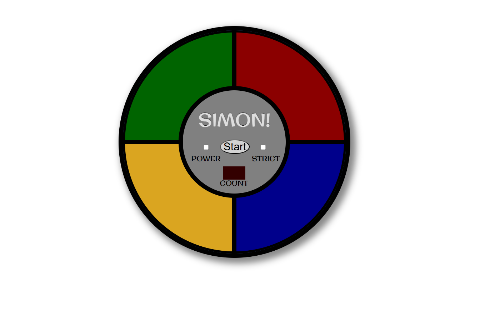
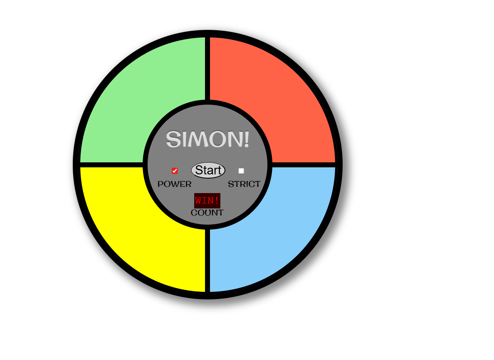

# Simon Game 🎮

A browser-based Simon memory game built with HTML, CSS, and JavaScript. The game shows a sequence of colored pads, and the player must repeat the same pattern in the correct order.

## Overview 🧠

This project recreates the classic Simon memory challenge with four colored buttons, sound feedback, a power toggle, a start button, strict mode, and a turn counter. Each round adds to the sequence, making the game harder as the player progresses.

## Features ✨

- Four-color Simon game board
- Sound feedback for each color
- Power toggle to turn the game on and off
- Start button to begin a new round
- Strict mode option
- Turn counter display
- Visual feedback for correct moves, wrong moves, and winning
- Browser-only setup with no build tools required

## Screenshots 📸

**Start Screen**



**Action Screen**



## How To Play 🕹️

1. Turn on the **Power** toggle.
2. Click the **Start** button.
3. Watch the color sequence shown by the game.
4. Repeat the sequence by clicking the colored pads in the same order.
5. If your move is correct, the game continues to the next round.
6. If your move is wrong, the game shows `NO!`.
7. In strict mode, a wrong move restarts the game.

## Installation 🚀

1. Clone or download the repository.
2. Open the `Simon game` folder.
3. Open `index.html` in your browser.

No package installation is needed.

## Project Structure 📁

```text
Simon game/
|-- index.html
|-- style.css
|-- index.js
|-- README.md
`-- assets/
    |-- Simon-start.png
    `-- Simon-action.png
```

## File Summary 📝

- `index.html` contains the game layout and audio sources.
- `style.css` controls the Simon board design and page styling.
- `index.js` handles sequence generation, player input, game state, strict mode, and win/loss feedback.

## Notes 💡

- The game uses external audio files from FreeCodeCamp.
- The page also loads the Original Surfer font from Google Fonts.
- Some browsers may require the user to interact with the page before audio can play.
- In the current JavaScript, the game declares a win after 3 correct inputs, even though it generates a 20-step sequence.

## Future Improvements 🔧

- Make the win condition use the full 20-step sequence.
- Add a high score counter.
- Store high scores in local storage.
- Improve mobile responsiveness.
- Add a sound on/off setting.
- Add keyboard support.

## License 📄

This project is free to use and modify for learning and personal practice.

## Creator 👨‍💻

**Ayush Aryan**
